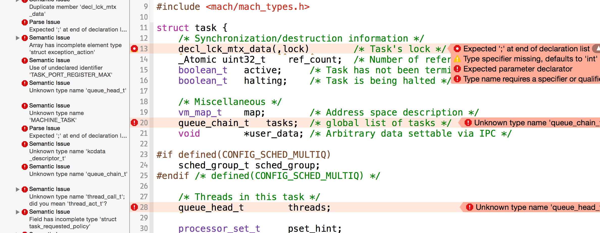
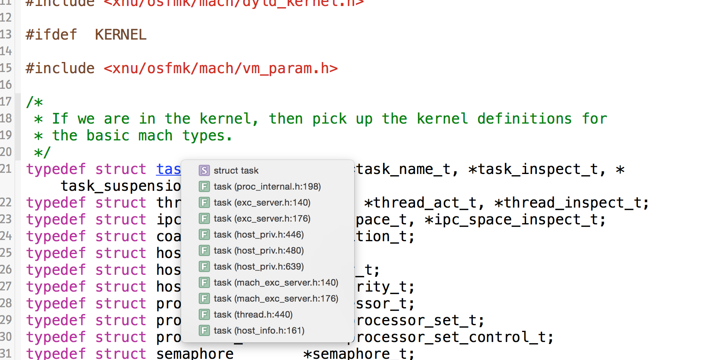
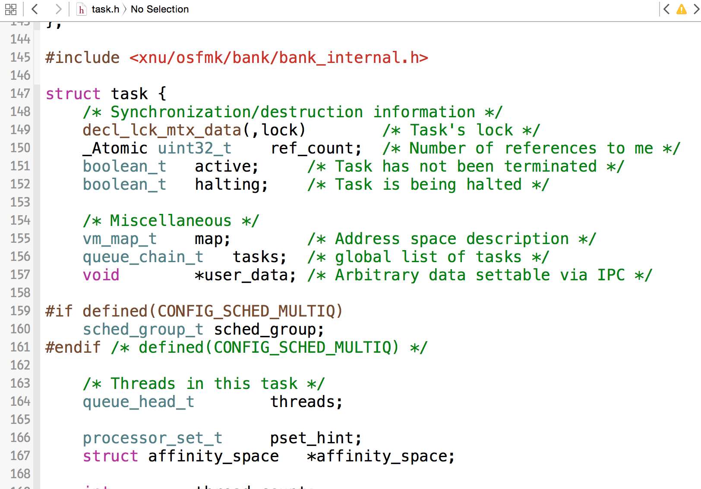
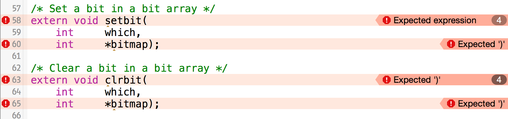
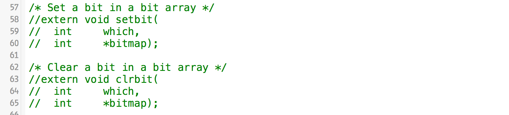
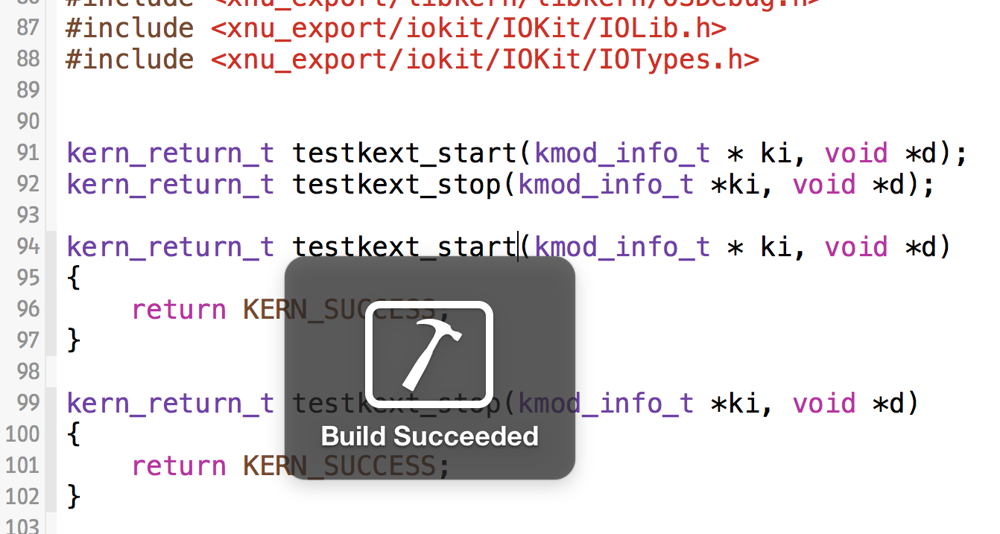
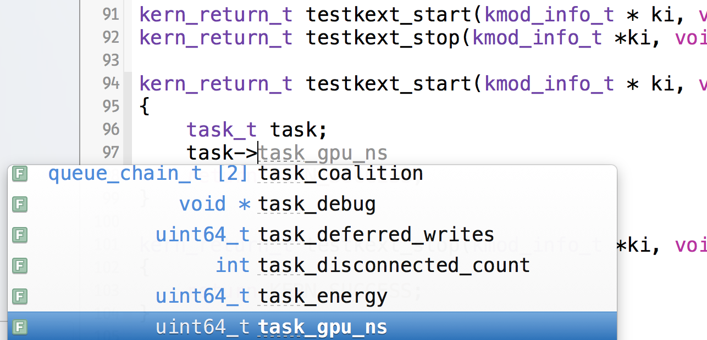
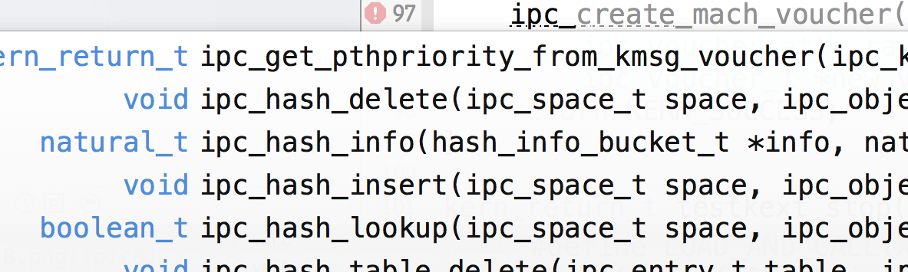

# XNU Rootkit Development - Generate Headers
Build your own complete XNU kernel header set, replaces Kernel.framework. Gain access to kernel private structures and symbols etc with IDE indexing worked.

[](https://twitter.com/cocoahuke) [](https://travis-ci.org/cocoahuke/rootkitdev_genheaders) [](https://github.com/cocoahuke/rootkitdev_genheaders/blob/master/LICENSE) []()

## Why would you need a Rootkit ?

- Vulnerability research and exploit development
- Study Kernel and turn your thoughts to code
- In order to have higher level control of your personal computer at software level
- ...

Before this, you may have used the **kernel.framework** in the MacOS native SDK, Kernel.framework is indeed richer than a file with the same name under the SDK:

##### In Xcode Application template:

```
#include <mach/mach_types.h> ->
...
typedef mach_port_t		task_t;
typedef mach_port_t		task_name_t;
typedef mach_port_t		task_suspension_token_t;
```
##### In Xcode Driver or KEXT template (Headers are link from Kernel.framework):
```
#include <mach/mach_types.h> ->
...
typedef struct task			*task_t, *task_name_t, *task_suspension_token_t;
typedef struct thread		*thread_t, *thread_act_t;
typedef struct ipc_space		*ipc_space_t;
```

Then stop here, Kernel.framework will not link you any further to the structure internal definition.
You get undeclared/unknown/incomplete issues flood if you copy the entire structure definition.



Right, If you carefully add all related things and delete all irrelevant things, it's possible to eliminate all issues.  

I'm willing to share the program I used, to solve this problem.
> Actually, I have tried method described in apple/darwin-xnu, it was on another computer, still not sure how to extend headers in kernel.framework after successful compiling, and for a different version of xnu, the compiler throw errors, troublesome... Therefore later I wrote this program turn xnu source to header use in KEXT development.

Anyway, If you desire a quick solution, this program can give you satisfactory results, applicable to all xnu versions, no need for complete compile.

###### command(⌘) + [Cursor Click]



###### macros and types etc lit up!


if you are interested so far, keep reading.

## XNU Transformation Steps

#### Step 1
Download `rootkitdev_genheaders` and compile by `make` command.

#### Step 2

Choose a version of xnu source and [**Download**](https://opensource.apple.com/tarballs/xnu/)

#### Step 3

I take the latest version as an example, unpack and compile it.
```
make ARCH_CONFIGS="X86_64" KERNEL_CONFIGS=RELEASE SDKROOT=macosx
```
> The purpose of compiling is to copy some files from BUILD, mig routine header, macro value defines etc...  
You are good as long as you can find something generated beneath BUILD/obj/RELEASE_X86_64 after compile. you can ignore compiler errors.

#### Step 4
Use `rootkitdev_genheaders`
```
rootkitdev_genheaders <path: xnu source folder> <path: output folder>

```
Example:
```
rootkitdev_genheaders /Desktop/xnu-4570.41.2 /Desktop/xnu_export
OUTPUT:
/Desktop/xnu-4570.41.2/security/_label.h -> /Desktop/xnu_export/security/_label.h ✔
/Desktop/xnu-4570.41.2/security/mac.h -> /Desktop/xnu_export/security/mac.h ✔
  sys/types.h >>> xnu/bsd/sys/types.h
/Desktop/xnu-4570.41.2/security/mac_alloc.h -> /Desktop/xnu_export/security/mac_alloc.h ✔
  mach/machine/vm_types.h >>> xnu/osfmk/mach/machine/vm_types.h
  kern/kern_types.h >>> xnu/osfmk/kern/kern_types.h
  sys/appleapiopts.h >>> xnu/bsd/sys/appleapiopts.h
/Desktop/xnu-4570.41.2/security/mac_data.h -> /Desktop/xnu_export/security/mac_data.h ✔
/Desktop/xnu-4570.41.2/security/mac_framework.h -> /Desktop/xnu_export/security/mac_framework.h ✔
  sys/kauth.h >>> xnu/bsd/sys/kauth.h
  sys/kernel_types.h >>> xnu/bsd/sys/kernel_types.h
/Desktop/xnu-4570.41.2/security/mac_internal.h -> /Desktop/xnu_export/security/mac_internal.h ✔
  string.h >>> xnu/osfmk/libsa/string.h
  sys/param.h >>> xnu/bsd/sys/param.h
  ...
/Desktop/xnu_export/osfmk/mach/machtrap.h created
Complete

```

#### Step 5

The header files just generated will still contain some flaws, The best way to fix them is to create a new template project `(OS X -> System Plug-in -> Generic Kernel Extension)` in Xcode.

##### - Import generated headers into project

Move the generated folder (In example: `/Desktop/xnu_export`) to where you store the header files, such as `/usr/local/include`. Or custom place, please add entry to `Build Settings` -> `Search Paths` -> `Header Search Paths` (In example: `/Desktop`)

##### - Include headers (To make the indexing work)

These are the header files I usually include, please include these  if you don't have a better idea. (The macro definitions is necessary)  
If you have multiple files in the project, you can create a file named `common.h`, and then write these into the file.

Also, please change `xnu_export` to your determined name. (Tip: TextEdit - Find and replace)
```
#define BSD_KERNEL_PRIVATE 1
#define XNU_KERNEL_PRIVATE 1
#define MACH_KERNEL_PRIVATE 1
#define MACH_BSD 1
#define CONFIG_TRIGGERS 1
#define KERNEL 1
#define CONFIG_REQUIRES_U32_MUNGING 1
//#define __APPLE_API_PRIVATE 1
#define __DARWIN_64_BIT_INO_T 1
#define PRIVATE 1
#define CONFIG_DYNAMIC_CODE_SIGNING 1
#define CONFIG_DTRACE 1
#define CONFIG_MACF 1
#define CONFIG_SCHED_MULTIQ 1
#define CONFIG_SCHED_PROTO 1
#define CONFIG_WORKQUEUE 1
#define CONFIG_SCHED_TIMESHARE_CORE 1
#define IMPORTANCE_INHERITANCE 1
#define KPC 1
#define KPERF 1
#define HYPERVISOR 1
#define CONFIG_BANK 1
#define CONFIG_IOSCHED 1

#include <xnu_export/stdint.h>
#include <xnu_export/stdarg.h>
#include <xnu_export/mach-o/loader.h>
#include <xnu_export/mach-o/nlist.h>
#include <xnu_export/bsd/i386/types.h>
#include <xnu_export/bsd/sys/errno.h>
#include <xnu_export/bsd/sys/fcntl.h>
#include <xnu_export/bsd/sys/mount.h>
#include <xnu_export/bsd/sys/resourcevar.h>
#include <xnu_export/bsd/sys/malloc.h>
#include <xnu_export/bsd/sys/vnode.h>
#include <xnu_export/bsd/sys/sysent.h>
#include <xnu_export/bsd/sys/vnode_internal.h>
#include <xnu_export/bsd/sys/vnode.h>
#include <xnu_export/bsd/sys/file_internal.h>
#include <xnu_export/bsd/sys/namei.h>
#include <xnu_export/bsd/sys/proc.h>
#include <xnu_export/bsd/sys/random.h>
#include <xnu_export/bsd/sys/proc_internal.h>
#include <xnu_export/bsd/sys/proc_info.h>
#include <xnu_export/bsd/sys/sysproto.h>
#include <xnu_export/bsd/sys/vnode_internal.h>
#include <xnu_export/bsd/sys/sysproto.h>
#include <xnu_export/bsd/sys/file_internal.h>
#include <xnu_export/bsd/sys/uio_internal.h>
#include <xnu_export/bsd/sys/pipe.h>
#include <xnu_export/bsd/sys/sysctl.h>
#include <xnu_export/bsd/sys/dirent.h>
#include <xnu_export/bsd/sys/imgact.h>
#include <xnu_export/bsd/kern/mach_loader.h>
#include <xnu_export/bsd/libkern/libkern.h>
#include <xnu_export/osfmk/kern/syscall_sw.h>
#include <xnu_export/osfmk/kern/task.h>
#include <xnu_export/osfmk/kern/debug.h>
#include <xnu_export/osfmk/kern/kern_types.h>
#include <xnu_export/osfmk/kern/ipc_kobject.h>
#include <xnu_export/osfmk/kern/ipc_kobject.h>
#include <xnu_export/osfmk/vm/vm_protos.h>
#include <xnu_export/osfmk/i386/proc_reg.h>
#include <xnu_export/osfmk/mach/kmod.h>
#include <xnu_export/osfmk/mach/mach_vm.h>
#include <xnu_export/osfmk/mach/thread_status.h>
#include <xnu_export/osfmk/mach/vm_prot.h>
#include <xnu_export/osfmk/ipc/ipc_hash.h>
#include <xnu_export/osfmk/ipc/ipc_right.h>
#include <xnu_export/osfmk/ipc/ipc_port.h>
#include <xnu_export/osfmk/ipc/ipc_importance.h>
#include <xnu_export/osfmk/libsa/string.h>
#include <xnu_export/osfmk/vm/vm_map.h>
#include <xnu_export/osfmk/vm/vm_map.h>
#include <xnu_export/osfmk/vm/pmap.h>
#include <xnu_export/osfmk/i386/pmap.h>
#include <xnu_export/osfmk/i386/rtclock_protos.h>
#include <xnu_export/osfmk/i386/pmap_internal.h>
#include <xnu_export/libkern/libkern/OSMalloc.h>
#include <xnu_export/libkern/libkern/OSDebug.h>
#include <xnu_export/iokit/IOKit/IOLib.h>
#include <xnu_export/iokit/IOKit/IOTypes.h>
```

##### - Clean up the errors in the header file

  

You may get 10~20 errors emitted, very simple to fix them, and only need once.

###### How to fix them - Comment'em all

Example:



Is going to be:



Get it ?


###### When you all fixed






## At last

Yes, You will find a lot **Private KPI** appear in the autocomplete list, your kext will be rejected when loading due to the use Private KPI. `kextlibs` tool can use to Check if you have used.

In order to use them, you need to calculate their address in memory.


